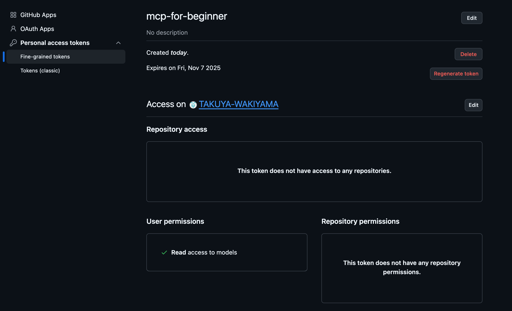

# .envについて

[公式ドキュメント](https://github.com/microsoft/mcp-for-beginners/blob/main/03-GettingStarted/03-llm-client/README.md#authentication-using-github-personal-access-token)の補足

`Configure Your Token`で、scopeを決めるが、Modelを指定すればOKっぽい

